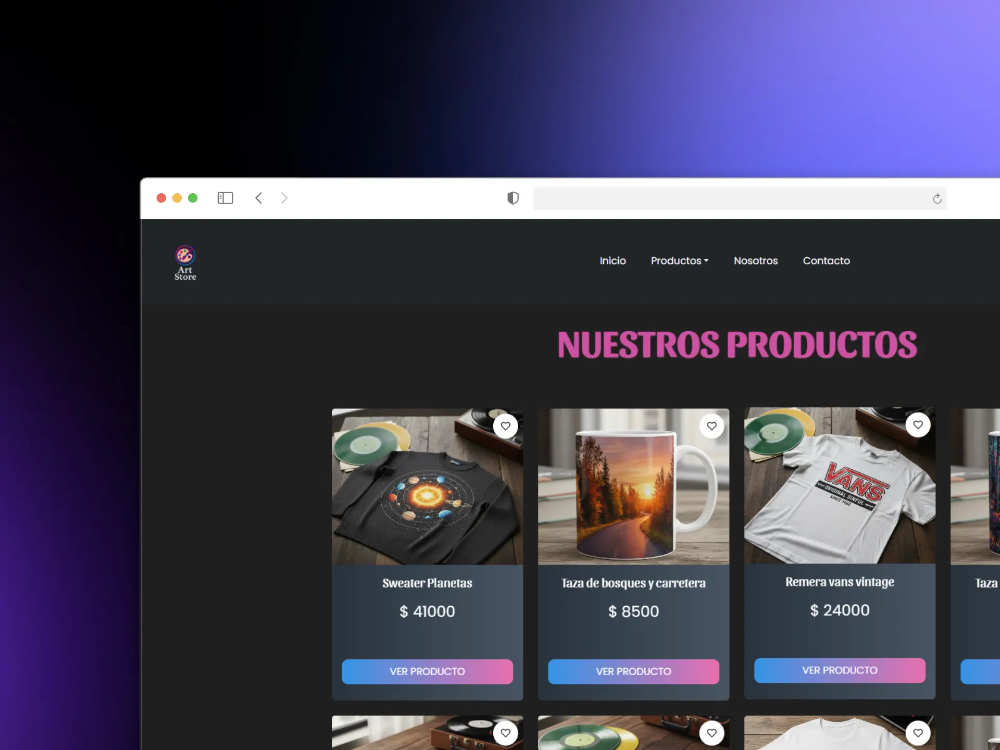

# 🎨 Art Store App

<div align="center">


**E-commerce moderno de productos personalizados con React 19, Vite 7 y Firebase**



[Ver Demo](https://art-store-pink.vercel.app)

</div>

---

## ✨ Características Principales

### 🛍️ Funcionalidades E-commerce
- **Catálogo dinámico** - Productos personalizados (gorras, tazas, remeras, sweaters)
- **Carrito completo** - Gestión de productos con persistencia
- **Sistema de órdenes** - Generación y tracking de compras
- **Filtros avanzados** - Búsqueda y categorización de productos
- **Detalle de producto** - Vista completa con información y stock
- **Checkout validado** - Formulario con validaciones en tiempo real

### 🎨 Interfaz Moderna
- **Animaciones fluidas** - React Spring para transiciones suaves
- **Scroll animations** - Intersection Observer para efectos al scroll
- **Feedback visual** - Toast notifications y alertas elegantes
- **Loading states** - Spinners y top loading bar
- **Responsive Design** - Adaptado a todos los dispositivos (mobile-first)
- **UI moderna** - Componentes con React Bootstrap

### 🔥 Tecnologías Avanzadas
- **React 19** - Última versión con mejoras de rendimiento
- **Vite 7** - Build tool ultra rápido con HMR instantáneo
- **Firebase 12** - Base de datos en tiempo real (Firestore)
- **React Router v7** - Navegación declarativa y code splitting
- **Context API** - Gestión de estado global del carrito
- **Custom Hooks** - Lógica reutilizable y separación de concerns
- **React Hook Form** - Validaciones performantes de formularios
- **Yup Schemas** - Validación de datos robusta

---

## 📦 Instalación

### Requisitos Previos
- Node.js 20+ (recomendado: v20.0.0 o superior)
- npm o yarn
- Cuenta de Firebase

### Paso 1: Clonar el repositorio
```bash
git clone https://github.com/zeuschris/Art-Store.git
cd Art-Store
```

### Paso 2: Instalar dependencias
```bash
npm install
```

### Paso 3: Configurar variables de entorno
Crea un archivo `.env` en la raíz del proyecto:

```env
VITE_FIREBASE_API_KEY=tu_api_key
VITE_FIREBASE_AUTH_DOMAIN=tu_auth_domain
VITE_FIREBASE_PROJECT_ID=tu_project_id
VITE_FIREBASE_STORAGE_BUCKET=tu_storage_bucket
VITE_FIREBASE_MESSAGING_SENDER_ID=tu_sender_id
VITE_FIREBASE_APP_ID=tu_app_id
```

### Paso 4: Configurar Firebase
1. Crea un proyecto en [Firebase Console](https://console.firebase.google.com/)
2. Habilita **Firestore Database**
3. Crea las colecciones necesarias:
   - `products` - Para productos del catálogo
   - `orders` - Para órdenes de compra

### Paso 5: Iniciar el servidor de desarrollo
```bash
npm run dev
```

El proyecto estará disponible en `http://localhost:5173`

---

## 🎯 Scripts Disponibles

```bash
npm run dev          # Inicia servidor de desarrollo con Vite
npm run build        # Build optimizado para producción
npm run preview      # Preview del build de producción
npm run lint         # Ejecuta ESLint para revisar código
```

---

## 📁 Estructura del Proyecto

```
Art-Store/
├── public/
│   └── art-store-preview.webp
├── src/
│   ├── components/          # Componentes React
│   │   ├── Cart/           # Carrito de compras
│   │   ├── Checkout/       # Proceso de checkout
│   │   ├── ItemDetail/     # Detalle de producto
│   │   ├── ItemList/       # Lista de productos
│   │   ├── NavBar/         # Navegación principal
│   │   └── Footer/         # Pie de página
│   ├── context/            # Context API
│   │   └── CartContext.jsx # Estado global del carrito
│   ├── firebase/           # Configuración de Firebase
│   │   └── config.js
│   ├── hooks/              # Custom Hooks
│   │   ├── useProducts.js
│   │   └── useCart.js
│   ├── pages/              # Páginas/Vistas
│   │   ├── Home.jsx
│   │   ├── Category.jsx
│   │   ├── ProductDetail.jsx
│   │   └── Checkout.jsx
│   ├── utils/              # Funciones auxiliares
│   ├── styles/             # Estilos globales
│   ├── App.jsx             # Componente principal
│   ├── main.jsx            # Punto de entrada
│   └── index.css
├── .env                    # Variables de entorno
├── .gitignore
├── eslint.config.js        # Configuración ESLint
├── index.html              # HTML template
├── package.json
├── vite.config.js          # Configuración de Vite
└── README.md
```

---

## 🛠️ Tecnologías y Librerías

| Categoría | Tecnología | Versión |
|-----------|-----------|---------|
| **Framework** | React | 19.1.1 |
| **Build Tool** | Vite | 7.1.7 |
| **Routing** | React Router DOM | 7.9.6 |
| **UI Framework** | React Bootstrap | 2.10.10 |
| **Styling** | Bootstrap | 5.3.8 |
| **Database** | Firebase | 12.6.0 |
| **Forms** | React Hook Form | 7.68.0 |
| **Validation** | Yup | 1.7.1 |
| **Form Resolvers** | @hookform/resolvers | 5.2.2 |
| **Animations** | @react-spring/web | 10.0.3 |
| **Scroll Observer** | React Intersection Observer | 10.0.0 |
| **Notifications** | React Toastify | 11.0.5 |
| **Alerts** | SweetAlert2 | 11.26.3 |
| **Spinners** | React Spinners | 0.17.0 |
| **Loading Bar** | React Top Loading Bar | 3.0.2 |
| **Icons** | React Icons | 5.5.0 |

---

## 🔥 Características Técnicas

### Performance
- ⚡ **Vite 7** - Build hasta 100x más rápido que Webpack
- 🔄 **HMR instantáneo** - Hot Module Replacement sin recarga completa
- 📦 **Code Splitting** - Carga optimizada con React Router
- 🗜️ **Minificación** - CSS y JS optimizados en producción
- 🖼️ **Lazy Loading** - Imágenes y componentes cargados on-demand

### UX/UI
- 🎭 **Animaciones GPU** - Transiciones aceleradas por hardware con React Spring
- 📱 **Mobile First** - Diseño optimizado para dispositivos móviles
- 🎨 **Visual Feedback** - Toasts, alerts y loading indicators
- ⚡ **Scroll Animations** - Efectos activados por Intersection Observer
- 🎯 **Loading States** - Top bar y spinners para mejor percepción

### Seguridad
- 🔐 **Variables de entorno** - Credenciales protegidas con Vite
- ✅ **Validaciones robustas** - React Hook Form + Yup
- 🛡️ **Sanitización** - Inputs validados y sanitizados
- 🔒 **Firebase Rules** - Reglas de seguridad en Firestore

---

## 🚀 Despliegue

### Vercel (Actual)
El proyecto está desplegado en Vercel con deployment automático desde la rama `main`.

🔗 **Demo**: [Art-Store](https://art-store-pink.vercel.app)

```bash
npm install -g vercel
vercel
```

### Netlify
```bash
npm run build
# Arrastra la carpeta dist/ a Netlify
```

### Firebase Hosting
```bash
npm install -g firebase-tools
firebase login
firebase init hosting
firebase deploy
```

---

## 🎨 Activos Visuales

### Diseño con IA
Las imágenes de productos fueron generadas con **Google Gemini AI**, proporcionando:
- Estética moderna y profesional
- Identidad visual única y coherente
- Imágenes optimizadas para web
- Diseños creativos y originales

---

## 📝 Roadmap

### ✅ Completado
- [x] Catálogo de productos dinámico
- [x] Carrito de compras completo
- [x] Sistema de checkout validado
- [x] Integración con Firebase/Firestore
- [x] Diseño responsive
- [x] Animaciones y transiciones
- [x] Sistema de órdenes
- [x] Validación de formularios

---

## 🤝 Contribuciones

Las contribuciones son bienvenidas. Para cambios importantes:

1. Fork el proyecto
2. Crea tu Feature Branch (`git checkout -b feature/AmazingFeature`)
3. Commit tus cambios (`git commit -m 'Add: nueva característica'`)
4. Push a la Branch (`git push origin feature/AmazingFeature`)
5. Abre un Pull Request

### Convención de Commits
```
feat: Nueva característica
fix: Corrección de bug
docs: Cambios en documentación
style: Cambios de formato
refactor: Refactorización de código
test: Añadir tests
chore: Tareas de mantenimiento
```

---

## 📄 Licencia

Este proyecto está bajo la Licencia MIT. Consulta el archivo `LICENSE` para más detalles.

---

## 👤 Autor

**Christopher Montes**

- 🌐 Portfolio: [portfolio-dev-chris.vercel.app](https://portfolio-dev-chris.vercel.app)
- 💼 GitHub: [@zeuschris](https://github.com/zeuschris)
- 💻 Rol: Frontend React Developer

## 📞 Soporte

¿Encontraste un bug o tienes una sugerencia?
- 🐛 [Reportar Bug](https://github.com/zeuschris/Art-Store/issues)
- 💡 [Solicitar Feature](https://github.com/zeuschris/Art-Store/issues)
- 📧 Contacto: [GitHub Profile](https://github.com/zeuschris)

---

<div align="center">

**⭐ Si te gustó este proyecto, dale una estrella en GitHub!**

[⬆ Volver arriba](#-art-store-app)

</div>